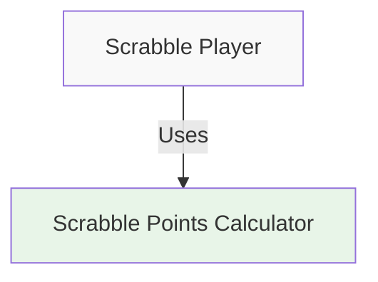
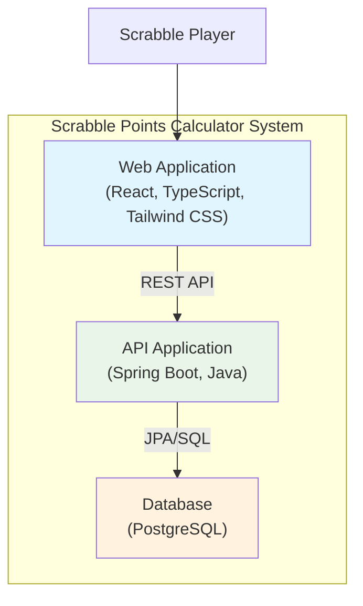

# System Architecture Overview

This document follows the C4 model principles to design and visualize the system architecture at different levels of abstraction, from high-level system context to detailed implementation components.

## C1: System Context

*What is the system and who uses it?*

## C2: Container Diagram

*How is the system structured and what technologies are used?*

