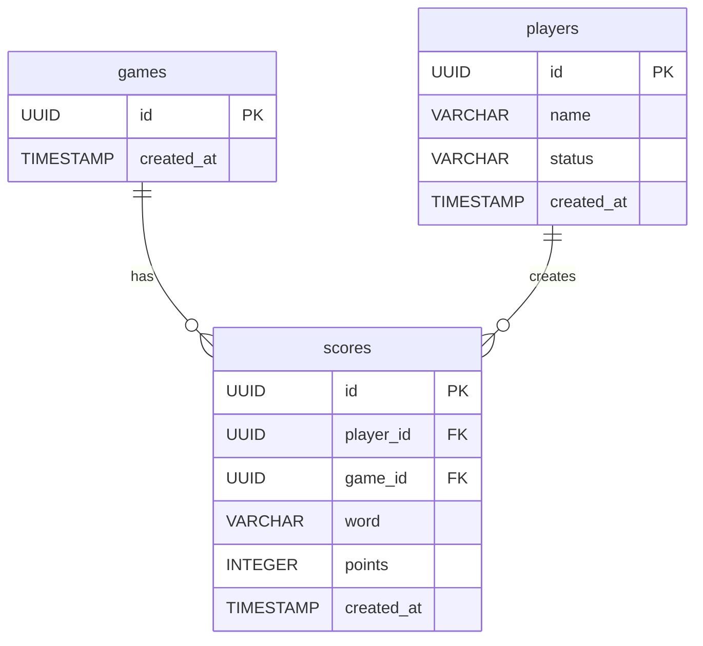

# C3: Database Schema

*How is data structured and related in the PostgreSQL database?*

## Database Schema (PostgreSQL)

## Table Descriptions

### games
- **id**: Unique identifier for each game session
- **created_at**: Timestamp when the game was created

### players
- **id**: Unique identifier for each player
- **name**: Player's display name
- **status**: Player status (active, inactive, etc.)
- **created_at**: Timestamp when the player was created

### scores
- **id**: Unique identifier for each score record
- **player_id**: Foreign key reference to the player who achieved the score
- **game_id**: Foreign key reference to the game session
- **word**: The word that was spelled to achieve this score
- **points**: The calculated points for this word
- **created_at**: Timestamp when the score was recorded

## Relationships

- One game can have many scores (one-to-many)
- One player can create many scores (one-to-many)
- Each score belongs to exactly one game and one player