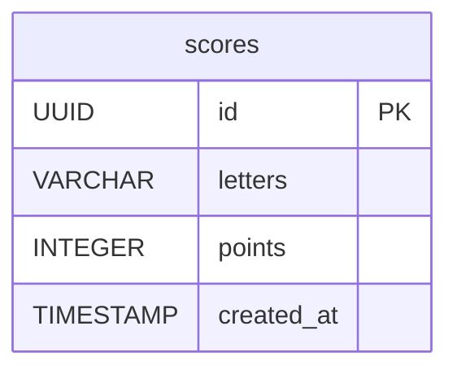

# C3: Database Schema

*How is data structured and related in the PostgreSQL database?*

## Database Schema (PostgreSQL)

## Notes

### scores
- **letters**: The letters entered in tiles to achieve this score (letters only, A-Z)
- **points**: Backend-computed points for these letters (never trust frontend)
- **created_at**: Used for tie-breaking when multiple scores are the same (earliest wins)
