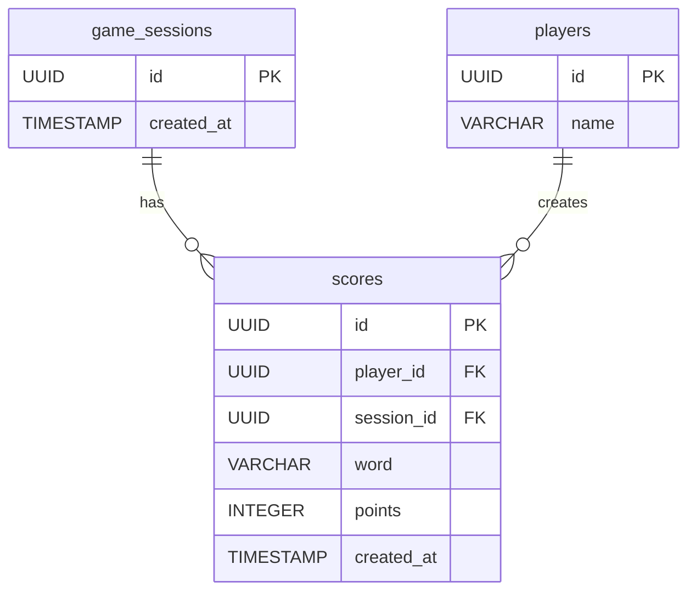

# C3: Database Schema

*How is data structured and related in the PostgreSQL database?*

## Database Schema (PostgreSQL)

## Notes

### players
- **name**: Randomly generated player display name (e.g., "Player123")

### scores
- **word**: The letters that were spelled to achieve this score (letters only, A-Z)
- **points**: Backend-computed points for this word (never trust frontend)
- **created_at**: Used for tie-breaking when multiple players have the same score (earliest wins)

## Relationships

- One game session can have many scores (one-to-many)
- One player can create many scores (one-to-many)
- Each score belongs to exactly one game session and one player