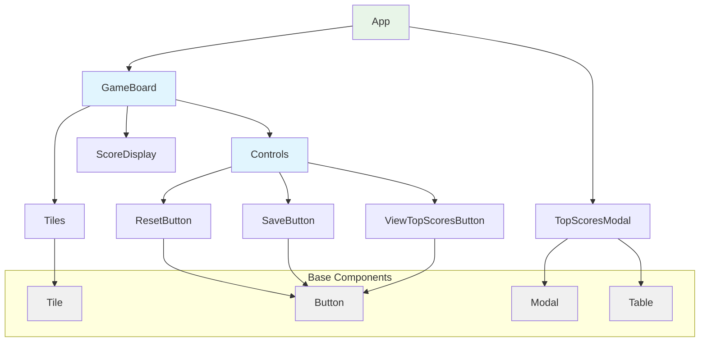

# C3: Frontend Components

*What are the key components within the web application?*

## Web Application Components (Frontend)



## Component Structure

```
src/
├── App.tsx (Main application container managing global state)
├── components/
│   ├── GameBoard/
│   │   ├── GameBoard.tsx (Main game area)
│   │   ├── Tiles.tsx (10 empty tiles for letter input with auto-focus/navigation, uses base/Tile.tsx)
│   │   ├── ScoreDisplay.tsx (Shows current calculated score)
│   │   ├── TopScoresModal.tsx (Modal showing top 10 scores, uses base/Modal.tsx + base/Table.tsx)
│   │   └── Controls/
│   │       ├── Controls.tsx (Action buttons container)
│   │       ├── ResetButton.tsx (uses base/Button.tsx)
│   │       ├── SaveButton.tsx (uses base/Button.tsx)
│   │       └── ViewTopScoresButton.tsx (uses base/Button.tsx)
│   └── base/
│       ├── Modal.tsx (Base modal component for overlays)
│       ├── Button.tsx (Base button component)
│       ├── Tile.tsx (Base tile component for individual letter input with auto-advance)
│       └── Table.tsx (Base table component for displaying data)
```