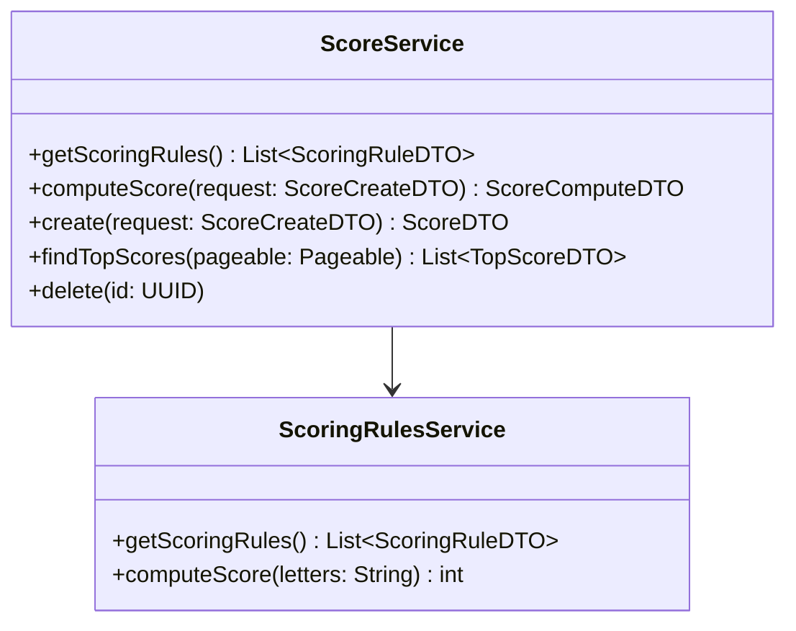

# C4: Code Implementation

*How do the backend service components interact with each other?*

## Backend Service Layer Class Diagram

```mermaid
classDiagram
    class ScoreService {
        +getScoringRules() List~ScoringRuleDTO~
        +computeScore(request: ScoreCreateDTO) ScoreComputeDTO
        +create(request: ScoreCreateDTO) ScoreDTO
        +findTopScores(pageable: Pageable) List~TopScoreDTO~
        +delete(id: UUID)
    }

    class ScoringRulesService {
        +getScoringRules() List~ScoringRuleDTO~
        +computeScore(letters: String) int
    }

    ScoreService --> ScoringRulesService
```