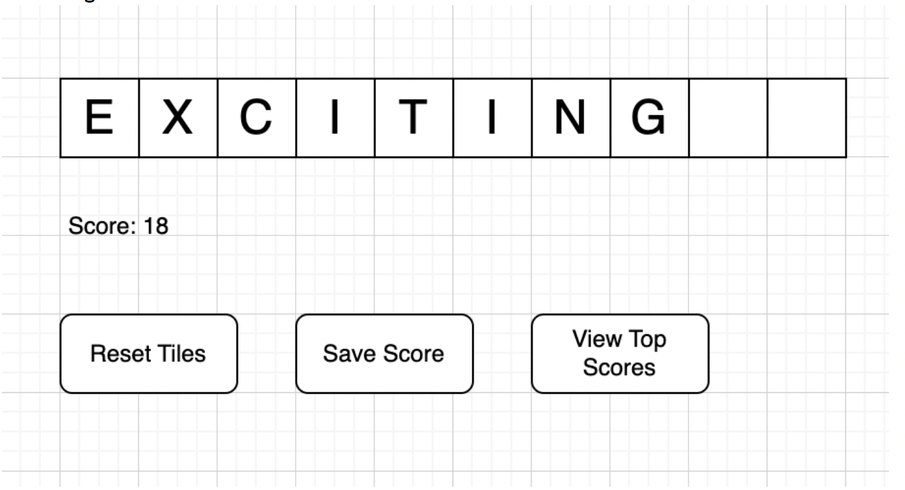

# Take-Home Challenge – Scrabble Points Calculator

## Notes
- Implement the solution as a **full stack web app**, with frontend and backend.  
- Please implement the **UI in React.js** and the **backend in Spring Boot** with either Java or Kotlin.  
- Push your code to a publicly accessible repo (GitHub or GitLab) – send us the link when done.  
- You may take up to **2 weeks** to submit your solution.  
- Optional: deploy your solution to a hosting environment; local deployment is fine.  
- Include a clear and concise **README.md** at the repo root, explaining how to run locally.  
- **Bonus points**: write unit tests and automated tests to show you take testing seriously.  

---

## Description
Design and build a **Scrabble points calculator**.

---

## The User Interface
- An example mock-up is provided below.  
- Feel free to improve the UI – flex your CSS and framework skills!

  

---

## Requirements
1. When the main page is first loaded, **10 empty tiles** are rendered.  
2. When the user fills the tiles with letters by typing, the **score is calculated in real-time**. (Letter scores are in the Appendix.)  
3. When the user clicks **Reset Tiles**, all letters are cleared.  
4. When the user clicks **Save Score**, the score should be stored in **persistent storage**.  
5. When the user clicks **View Top Scores**, the **top 10 scores** should be displayed.  
6. The project must include a **frontend (React)** and a **backend (Spring Boot with Java/Kotlin)**.  
7. The source code must be publicly available (e.g., GitHub, GitLab).  
8. The app must be runnable locally for the **pair programming interview round**.  

---

## Example
User enters: `exciting`  
- Final score = **18**  

Breakdown:
- E → 1  
- X → 8  
- C → 3  
- I → 1  
- T → 1  
- I → 1  
- N → 1  
- G → 2  

---

## Hints
- This handout is intentionally brief.  
- Candidates are encouraged to ask questions and clarify requirements.  

---

## Appendix – Letter Scoring Rules

| Letters                | Points |
|------------------------|--------|
| A, E, I, O, U, L, N, S, T, R | 1 |
| D, G                  | 2 |
| B, C, M, P            | 3 |
| F, H, V, W, Y         | 4 |
| K                     | 6 |
| J, X                  | 8 |
| Q, Z                  | 10 |
